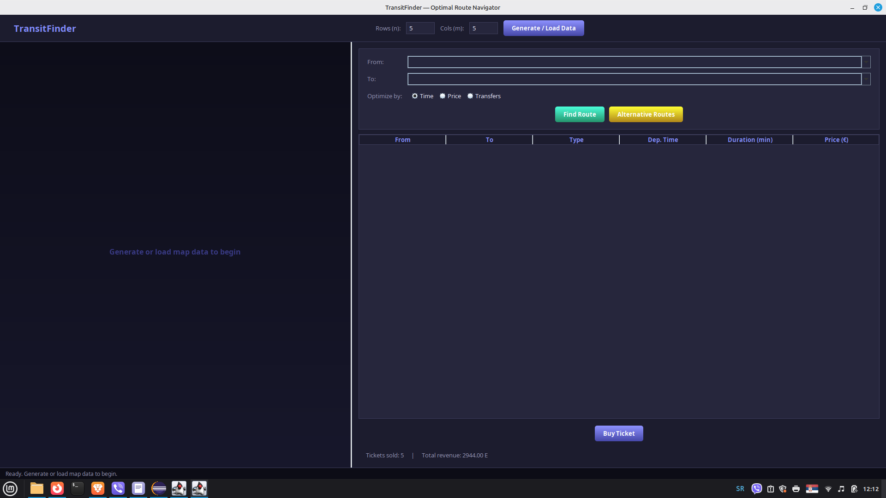
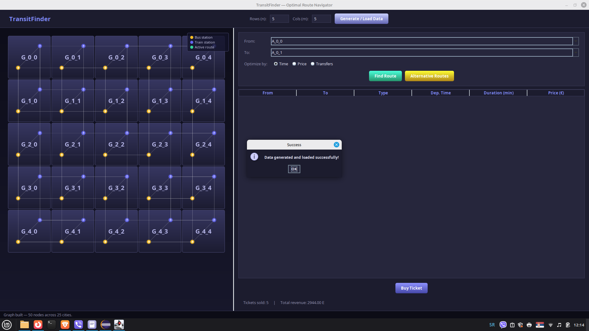
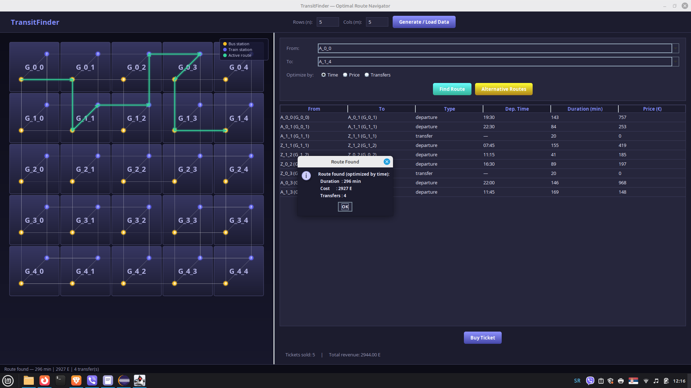
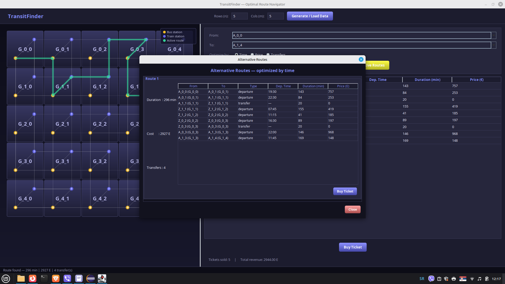

# 🚂 Transport Route Finder

This is a **Java desktop application** developed using the **Swing** library and **WindowBuilder**, designed to find optimal travel routes within a simulated transport network. 
The application allows users to search for the most efficient routes using a combination of bus and rail transport, optimizing the journey based on time, price, or the number of transfers.

## 🌟 Features

  * **Transport Network Generation:** Dynamic generation of a state as an $n \times m$ matrix of cities, where each city has a bus and a rail station with defined departures. Data is generated and saved in **JSON** format.
  * **Data Parsing and Mapping:** Loading and parsing transport data from a JSON file into an object-oriented structure.
  * **Graph Construction:** Building a **directed graph** of the transport network, where stations are the nodes, and departures and transfers are the edges.
  * **Optimal Route Finding:** Implementation of the **Dijkstra's Algorithm** to find the shortest route between two selected stations.
      * **Time Optimization:** Finds the fastest route.
      * **Price Optimization:** Finds the cheapest route.
      * **Transfer Optimization:** Finds the route with the minimum number of transfers.
  * **Interactive GUI:** An intuitive graphical user interface based on Swing for inputting parameters, map visualization, and displaying results.
  * **Route Visualization on Map:** Display of the generated city map with the found optimal route highlighted.
  * **Ticket Purchase:** Functionality for purchasing the selected route, generating a receipt in a text file, and saving it to a dedicated `racuni` (receipts) folder.
  * **Sales Statistics:** Display of the total number of tickets sold and the total revenue from sales, loaded upon application startup.
  * **Display of Additional Routes:** Option to display the top 5 routes (currently shows the optimal route as an example; a more advanced algorithm like K-Shortest Paths is required for actual top 5 implementation).

## 🚀 Technologies

  * **Language:** Java
  * **GUI:** Swing (with WindowBuilder for design)
  * **Data Structures/Algorithms:** Graphs, Dijkstra's Algorithm
  * **Serialization/Deserialization:** JSON (using an internal parser and generator)

## 🏗️ Project Structure

The project is organized into the following packages:

  * `main`: Contains the main class for running the application (`Main.java`).
  * `model`: Contains classes representing the transport network entities (e.g., `Station`, `Departure`, `TransportData`).
  * `graph`: Contains the implementation of the graph (`Graph.java`), nodes (`Node`), edges (`Edge`), and the logic for **Dijkstra's Algorithm**.
  * `util`: Helper classes for generating JSON data (`TransportDataGenerator`), parsing JSON (`SimpleJsonParser`), mapping parsed data (`TransportDataMapper`), and managing receipts (`ReceiptManager`).
  * `gui`: Contains classes for the graphical user interface (`MainWindow.java`, `MapPanel.java`, `AdditionalRoutesWindow.java`).

## ⚙️ Getting Started

1.  **Clone the Repository:**
    ```bash
    git clone [https://github.com/github-username/repository-name.git](https://github-username/repository-name.gitt)
    cd repository-name
    ```
2.  **Open the Project in Eclipse:**
      * `File > Import... > Maven > Existing Maven Projects` (if using Maven) or
      * `File > Import... > General > Existing Projects into Workspace` (if using a standard Java project).
3.  **Ensure WindowBuilder is Installed:**
      * If not, go to `Help > Install New Software...` and install `WindowBuilder` from your Eclipse release update site.
4.  **Java Version:** Java 11 or newer is recommended. If using Java 9+, ensure you add `requires java.desktop;` to your `module-info.java` file (if it exists) to enable access to the Swing library.
5.  **Run the Application:**
      * Right-click on `src/main/Main.java` \> `Run As > Java Application`.

## OR

🛠️ Development Setup (Eclipse IDE)

Follow these exact steps to avoid common "Missing Library" or "JDK Inconsistency" errors seen during development.
1. Prerequisites

    Eclipse IDE: 2024-03 Release or newer recommended.

    Java Development Kit (JDK): Version 21 is highly recommended (though 17 is supported).

    WindowBuilder Plugin: Required to edit the GUI forms (MainFrame.java, etc.).

2. Importing the Project

    Open Eclipse and select File > Import....

    Choose General > Existing Projects into Workspace and click Next.

    Select the root directory of this repository and click Finish.

3. Fixing the Build Path (Crucial)

You may see red "X" marks on the project due to local file paths. Fix them as follows:

    Right-click the project Pj2_2025 > Properties.

    Navigate to Java Build Path > Libraries.

    Remove any existing gson-2.10.1.jar entries that show an "error" icon (these point to the author's local folders).

    Click Add External JARs... and select the gson-2.10.1.jar located inside the project's /gson folder.

    Ensure the JRE System Library is set to JavaSE-21 or JavaSE-17 to match your installed JDK.

4. Compiler Settings

If you see errors regarding ct.sym or version mismatches:

    Go to Properties > Java Compiler.

    Uncheck "Use compliance from execution environment".

    Set Compiler compliance level to 17 or 21.

    Click Apply and Close, then select Yes to rebuild the project.

 ##  📖 How to Use the App

    Launch: Run src/main/Main.java as a Java Application.

    Initialize: Click the Generate / Load Data button at the top. The status bar will confirm "Data generated and loaded successfully".

    Search: * Enter your starting point (e.g., A_0_0) and destination (e.g., A_0_1).

        Select your optimization preference: Time, Price, or Transfers.

        Click Find Route.

    Purchase: Click Buy Ticket to save a receipt to the /receipts folder.
  
## Screenshots

> GUI screen with  preview 





 



## 📝 Author

  * AT95BL

-----
